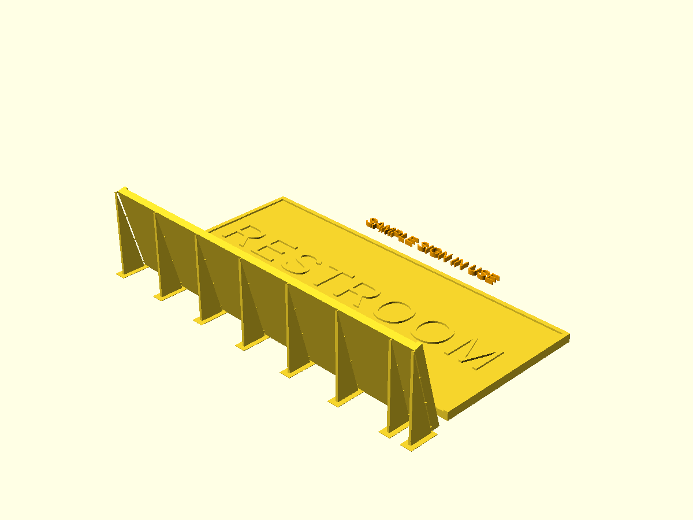
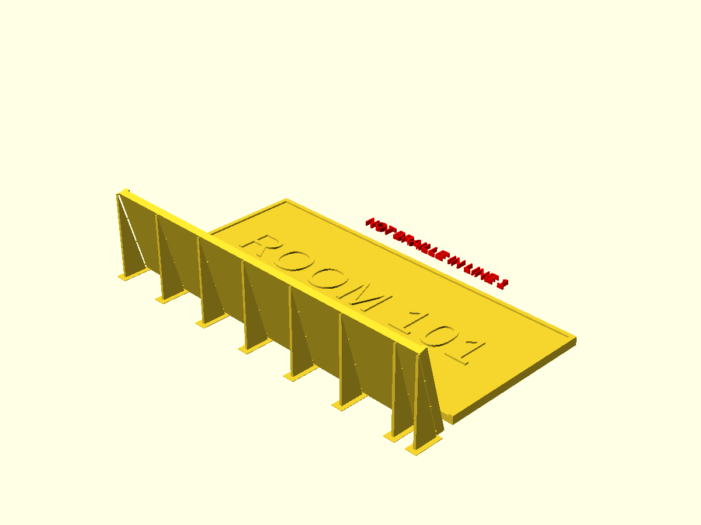

# Quick start

This page takes you from "I need a sign" to a finished sign on the wall: a
plate of raised letters with a braille plate below it. You do not need to know
3D modeling or code. Every setting is named here exactly as it appears in the
Customizer, OpenSCAD's panel of settings, so you can find it by name.

## What you are making

The generator makes a room sign in two parts. The **letter plate** carries the
words in raised capital letters, for reading by sight or by touch. The
**braille plate** carries the same words in braille. They are separate plates
because each prints best a different way: raised letters print cleanly lying
flat, and braille dots print smoothest on a plate that leans back at 75
degrees. When you mount them with the letters above the braille, the raised
borders of the two plates join into one frame around the sign.

<!-- photo: shot list item 2 -->

The picture below shows the default sign the way the printer makes it: the
letter plate lies flat with ROOM 101 in raised letters inside a raised border,
and the braille plate leans back on a row of thin support fins that you snap
off after printing. This view shows the back of the braille plate, so its dots
face away from you.

Seen from straight above, the plates sit the way they hang on the wall: the
letter plate on top, and the braille plate below it with its row of dots. The
raised letters are flat on top, so from this angle they barely show.

## What you need

- A 3D printer with a bed at least 170 mm wide for the default sign. Longer
  wording makes wider plates.
- PLA or PETG filament.
- The wording for your sign.
- Its braille: a braille translator, or the OpenSCAD Assistive Forge, which
  translates for you (Way 2).
- Adhesive strips or double-sided tape, and a tape measure, for mounting.

If you want one of the sample signs as it is (Restroom, Exit, Stairs or Room
101), both plates are ready to print in [the stl folder](../../stl/README.md):
skip to [Printing](#printing).

## Way 1: desktop OpenSCAD

OpenSCAD is a free program that turns the generator file into STL files you
can print. The two plates print best with different settings, so you export
them one at a time.

1. Download and install OpenSCAD 2021.01 or newer from [the OpenSCAD downloads
   page](https://openscad.org/downloads.html). A development snapshot renders
   this sign much faster: in seconds, where 2021.01 takes about a minute.
2. Download [`Braille_Sign_STL_Generator.scad`](../../Braille_Sign_STL_Generator.scad).
3. Open it in OpenSCAD with File > Open.
4. Show the Customizer panel: in the Window menu, tick Customizer. In OpenSCAD
   2021.01, untick Window > Hide Customizer instead.
5. In **Step 1 - Pick a sample sign or type your own**, set `sample_sign` to
   `Restroom`, `Exit`, `Stairs` or `Room 101`, or leave it on `Type my own`.
   A sample brings its own wording and braille, so go on to step 8.
6. Type your wording into `text_line_1`, one line of the sign per setting,
   with `text_line_2` to `text_line_6` for more lines.
7. In **Step 2 - Braille, pasted from a translator**, paste the braille for
   each line into the matching `braille_line_1` to `braille_line_6`: see
   [Translating your wording](#translating-your-wording).
8. Look at the preview, the picture that updates as you change a setting. Red
   words beside the sign mean something needs fixing: see [If something looks
   wrong](#if-something-looks-wrong).
9. In **Step 3 - What to export**, set `sign_part` to `Letter plate`.
10. Press F6 to render the plate, which builds its final shape.
11. Choose File > Export > Export as STL and save the file. Newer versions
    offer Export as STL (binary) and Export as STL (ascii); either works.
12. Set `sign_part` to `Braille plate`.
13. Press F6 again.
14. Export and save the braille plate the same way.

You can leave **Step 4 - Size** and the Advanced tabs alone: with `auto_fit`
on `Yes`, the plates grow to fit your wording.

<!-- photo: shot list item 7 -->

When you pick `Restroom` in step 5, the preview shows the letter plate reading
RESTROOM, and orange words beyond it remind you that a sample is in use.

## Way 2: in your browser with the Forge

The [OpenSCAD Assistive Forge](https://openscad-assistive-forge.pages.dev/)
runs this generator in your web browser, in a panel built for screen readers
and keyboards. It translates your wording into braille for you with liblouis,
an open-source braille translator, so you type plain words and can skip
[Translating your wording](#translating-your-wording). Open this sign in the
Forge:

<https://openscad-assistive-forge.pages.dev/?example=braille-sign>

The Forge keeps its own copy of the generator and updates it separately, so
its settings can have older names and defaults than the ones on this page.

## Way 3: MakerWorld

MakerWorld's Parametric Model Maker can run this file in your browser once the
sign is listed there. It cannot translate braille and shows no warnings, so you
paste braille from a translator and check the sizes yourself. [The MakerWorld
quick start](../MAKERWORLD_QUICK_START.md) walks you through it.

## Translating your wording

Skip this section if you picked a sample sign or use the Forge.

The braille lines take **Unicode braille**: characters that look like patterns
of dots, from the Unicode range U+2800 to U+28FF. ASCII braille, which looks
like ordinary letters and punctuation, does not work. Signs use contracted
braille (Grade 2, where common words and letter groups are shortened), as ADA
703.3 asks.

The steps below use [the Branah braille
translator](https://www.branah.com/braille-translator). Its own page says its
Grade 2 is still a work in progress and may shorten a word where it should
not, so check what it gives you, or use the Forge (Way 2), which translates
with liblouis.

1. Open the Branah braille translator.
2. Choose Grade 2 Braille.
3. Choose Unicode Braille.
4. Type one line of your wording in lowercase. Keep a capital only at the
   start of a sentence and for names, single letters, initials and acronyms:
   those are the only places ADA 703.3.1 allows the braille capital sign.
5. Copy the braille.
6. Paste it into the matching braille line: `braille_line_1` for line 1,
   `braille_line_2` for line 2, and so on.
7. Repeat steps 4 to 6 for each line.

**An automatic translator is not a certified transcriber.** For a sign in a
public building, have a transcriber certified in Unified English Braille (UEB)
check the braille before you print.

## Printing

Open each STL in your slicer, the program that prepares a file for your
printer. Print each plate as its own job, exactly as the generator lays it
out: do not rotate it, and do not add supports.

| Setting | Letter plate | Braille plate |
|---|---|---|
| On the bed | flat, letters up | leaning back on its fins |
| Layer height | 0.2 mm | 0.1 mm |
| Material | PLA or PETG | PLA or PETG |
| Supports | none | none |
| Brim | not needed | optional; one is modeled under each fin |
| Outer wall speed | normal | 30 to 40 mm/s or slower |

<!-- photo: shot list item 4 -->
<!-- photo: shot list item 3 -->

The braille plate gets the fine layers because a braille dot is at most 0.9 mm
(0.037 in) tall, so the layer height decides how smooth each dot feels. It gets the slow
outer wall because a thin plate leaning at 75 degrees wobbles at speed.

## After printing

1. Flex or snip the fins off the back of the braille plate.
2. Smooth the small nubs left where the fins joined the plate, with a
   fingernail or fine sandpaper.
3. Run a fingertip across the braille: each dot should feel round and firm,
   with no strings or blobs.
4. Measure a flat-topped capital letter, such as E, H, R or T, with a ruler or
   calipers: at the default `letter_height_mm` it is 16 mm tall. Round letters
   such as O and S stand about 0.5 mm taller.

<!-- photo: shot list item 5 -->
<!-- photo: shot list item 6 -->

## Mounting

The two plates touch on the wall. The letter plate carries the top and side
rails of the raised border, and the braille plate carries the bottom and side
rails, so when the plates meet, the rails run as one frame around the sign.

1. Lay the letter plate above the braille plate, both face up.
2. Push the plates together until their side rails meet in one straight line.
3. Stick adhesive strips or double-sided tape to the back of each plate.
4. Pick the height on the wall: the bottom row of braille at least 1220 mm
   (48 in) above the floor, and the baseline of the top line of letters (the
   line the letters stand on) at most 1525 mm (60 in) above the floor.
5. Press the letter plate onto the wall.
6. Press the braille plate onto the wall right below it, with the side rails
   meeting.

<!-- photo: shot list item 1 -->

ADA 703.3.2 asks for at least 9.5 mm (3/8 in) between the braille and the
raised letters. With the plates touching, the generator's spacing already
gives more than that: about 43 mm on the default sign.

> **ADA note.** The defaults follow the published §703 figures, but this tool
> does **not** guarantee compliance. Real signage has requirements this
> generator does not model — mounting height and location, contrast, glare,
> character width ratios, and the 9.5 mm (3/8 in) minimum braille offset below
> the raised text. Verify against the standard before installing.

## Contrast

The ADA Standards ask for raised letters that contrast with their background,
light on dark or dark on light, with a matte finish that does not glare. The
braille does not need to contrast. A print in one color has no contrast, so use
one of these:

- If your slicer can pause for a filament change, add one at the first layer
  above 3 mm, the top of the plate at the default `plate_thickness_mm`, so the
  raised letters and border print in the second color.
- Otherwise, paint the raised letters in a matte color that contrasts with the
  plate.

## If something looks wrong

When the generator finds a problem, it writes it in red beside the sign in the
preview. The words disappear when you render with F6, and they never reach the
STL. The console under the preview prints the same problem with its numbers.

- `NOT BRAILLE IN LINE 1` (or another line number): that braille line holds
  typed letters or ASCII braille. Paste Unicode braille from a translator.
- `TEXT TOO WIDE`: set `auto_fit` to `Yes`, raise `sign_width_mm`, or shorten
  the line.
- `TEXT TOO TALL`: set `auto_fit` to `Yes`, raise `letter_plate_height_mm`, or
  remove a line.
- `BRAILLE TOO WIDE`: set `auto_fit` to `Yes`, raise `sign_width_mm`, or
  shorten the line.
- `BRAILLE TOO TALL`: set `auto_fit` to `Yes`, raise `braille_plate_height_mm`,
  or remove a line.
- `BRAILLE TOO CLOSE TO BORDER`: the braille fits but sits closer than
  `braille_clearance_mm` to the border or the plate edge. Set `auto_fit` to
  `Yes`, raise `braille_plate_height_mm` or `sign_width_mm`, or shorten the
  braille.
- `LETTERS UNDER 16 MM`: `letter_height_mm` is under 16 mm (5/8 in), and ADA
  703.2.5 asks 16 mm or more. Raise it to 16 or more.
- `SAMPLE SIGN IN USE`, in orange: a sample is picked in `sample_sign`, so the
  text and braille lines are ignored. Set `sample_sign` to `Type my own` to use
  your own wording.

With typed letters in `braille_line_1`, the preview shows the red words NOT
BRAILLE IN LINE 1 beyond the far edge of the letter plate.

MakerWorld shows none of these words and has no console: [the MakerWorld quick
start](../MAKERWORLD_QUICK_START.md#7-troubleshooting) lists what each problem
looks like there. The [full guide](full-guide.md) explains every warning and
note, when each one appears, and how to fix it.
